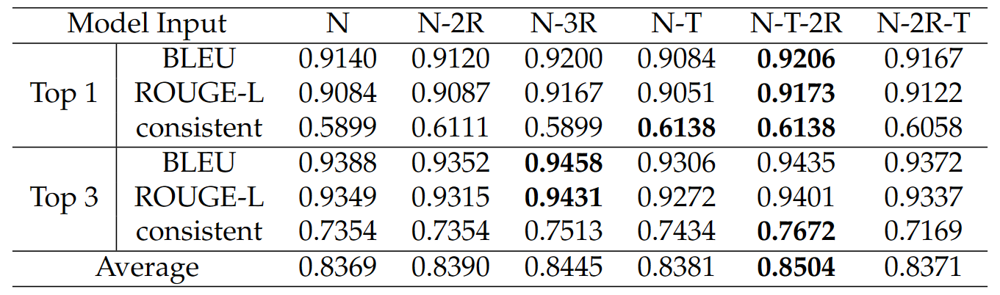

# Model Input

## Tested performance under different model input settings


Due to the prompt length constraint, we can not include the complete dataset in our model input. Therefore, we mainly considered 3 kinds of information from the dataset: column name, column type and data rows. 

We conducted an experiment to test the model performance under different dataset information provided and summarized the result in the table below. 

Specifically, `N` refers to column names, `R` refers to data rows, and `T` refers to column types. `2R` and `3R` refer to the top-2 data rows and top-3 data rows, respectively. 

We finally chose to include column names, column types and the top-2 data rows in our model input. 



## Input Organization

Model input on the Step `x`. Specifically, `<...>` serves as a seperation token. 

```
{table name}
<head> {column names}
<type> {column types}
<data> {data row 1} <line> {data row 2} <line>
<utterance> {NL utterance}
<ans>
<sep> {Step 1 prompt} {Answer 2}
...
<sep> {Step x-1 prompt} {Answer x-1}
<sep> {Step x prompt}
```

And the model should output the answer corresponding to step `x`.  

The step 1-6 prompts are as follows: 

```
Step 1. Select columns:
Step 2. Add filter:
Step 3. Add aggregations: 
Step 4. Select chart type:
Step 5. Choose encoding:
Step 6. Add sort:
```


